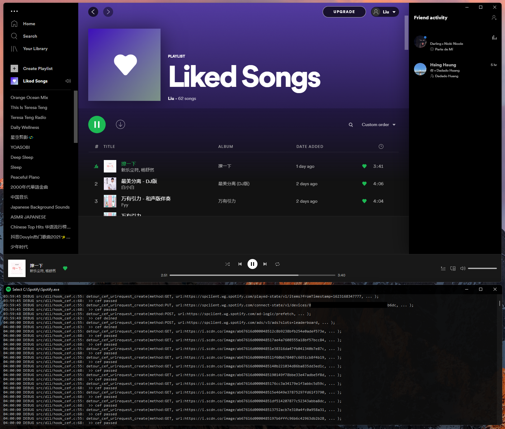
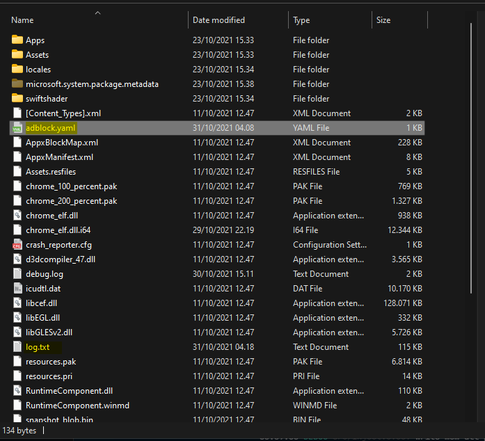
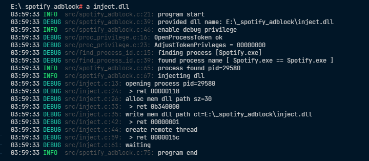

# Spotify AdBlock

Windows Spotify Ad Block, in `C` !

## Build

Open an issue with information related if any error occurs.

```bash
mingw32-make all
```

## Config example

name it `adblock.yaml`

```yaml
name: Config
cef_acl:
  - method: POST
    substr: /ads/
  - method: POST
    substr: /ad-logic/
block_host:
  - ad.spotify.com
```

## Preview





## License

[MinHook](https://github.com/TsudaKageyu/minhook/blob/master/LICENSE.txt)

[log.c](https://github.com/rxi/log.c/blob/master/LICENSE)

[cef](https://github.com/chromiumembedded/cef/blob/master/LICENSE.txt)

[chromium](https://chromium.googlesource.com/chromium/src/+/refs/heads/main/LICENSE)

[libcyaml](https://github.com/tlsa/libcyaml/blob/main/LICENSE)

[libyaml](https://github.com/yaml/libyaml/blob/master/License)

## License

ii64. 2021
